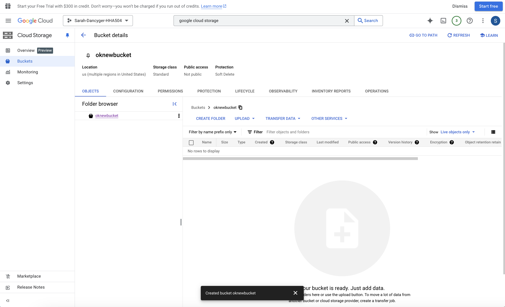

# HHA504_assignment_storage
HHA 504- Assignment: Working with Cloud Storage in Azure and GCP

## Objective

## The objective of this assignment is to familiarize you with cloud storage services in Azure and Google Cloud Platform (GCP). You will learn how to upload files to Azure Blob Storage and GCP Cloud Storage using both Python and the platform's GUI.

## *Azure*

### *Data file*

## *GCP*

### *Data file*